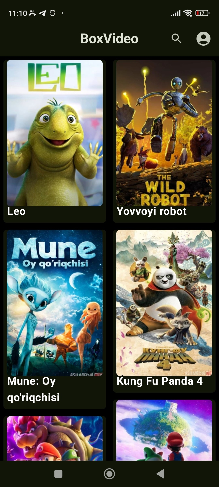
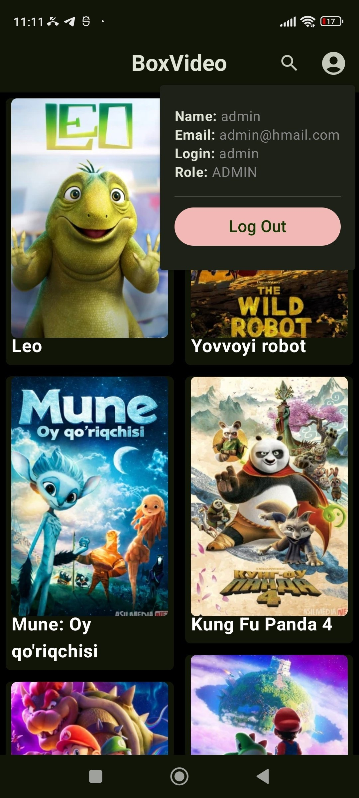
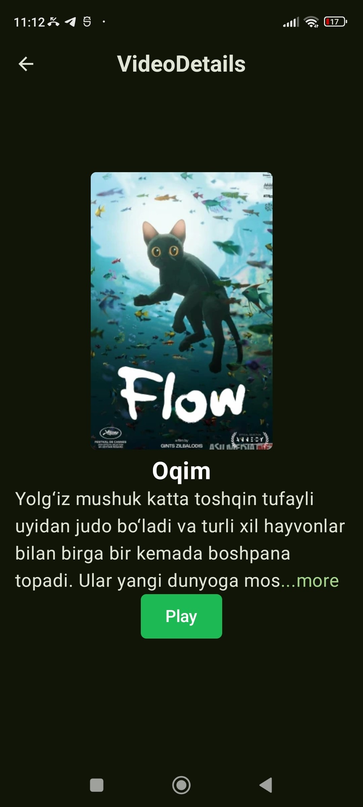
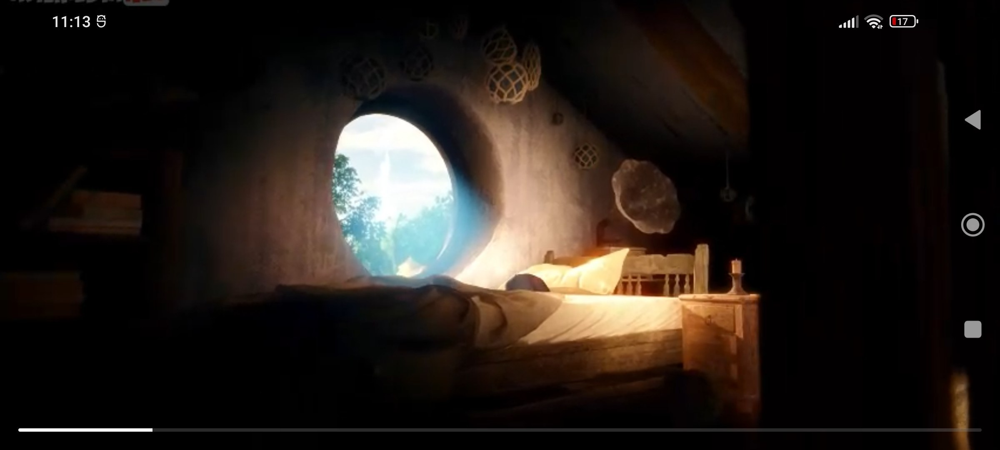

# BoxVideo

[English version](README.md)

BoxVideo — нативный Android-клиент для просмотра видеокаталога и потокового воспроизведения. Приложение подключается к backend API, авторизует пользователей с помощью bearer-токенов, сохраняет каталог в локальной базе Room и воспроизводит удалённые видео через Media3 ExoPlayer.

Интерфейс полностью построен на Jetpack Compose, а состояние экранов организовано по принципам MVVM. После входа пользователь может просматривать синхронизированный каталог, открывать страницу фильма, читать полное описание и запускать видео в отдельном горизонтальном плеере. При выходе из плеера воспроизведение может продолжаться в режиме «Картинка в картинке».

## Скриншоты

<p align="center">
  
  
  
</p>

<p align="center">
  
</p>

<p align="center">
  
</p>

## Возможности

- Регистрация и вход пользователя
- Восстановление сессии и проверка сохранённого токена при запуске
- Авторизованные API-запросы с bearer-токеном
- Синхронизация видеокаталога с удалённым сервером
- Локальное кэширование каталога в Room
- Реактивное обновление интерфейса через Kotlin `Flow`
- Экран фильма с обложкой, названием и раскрывающимся описанием
- Потоковое воспроизведение через Media3 ExoPlayer
- Интерактивная полоса прогресса с перемоткой
- Горизонтальный режим плеера
- Режим Picture-in-Picture на Android 8.0 и новее
- Просмотр данных профиля и выход из аккаунта

## Как работает приложение

1. При запуске BoxVideo читает сохранённый токен и проверяет его запросом `GET /auth/me`.
2. Если действующей сессии нет, приложение открывает экраны регистрации и входа.
3. После успешной авторизации серверный токен сохраняется в Preferences DataStore.
4. Приложение загружает каталог через `GET /videos` и записывает результат в Room в рамках транзакции.
5. Compose-интерфейс наблюдает за локальной базой, поэтому изменения каталога появляются на экране автоматически.
6. Нажатие на фильм открывает подробную информацию, а кнопка **Play** запускает первый доступный источник видео в ExoPlayer.
7. На поддерживаемых версиях Android при сворачивании плеер переходит в режим «Картинка в картинке».

## Технологии

| Область | Технология |
| --- | --- |
| Язык | Kotlin |
| Интерфейс | Jetpack Compose, Material 3 |
| Архитектура | MVVM, Repository pattern, однонаправленный поток состояния |
| Навигация | AndroidX Navigation 3 |
| Внедрение зависимостей | Dagger Hilt |
| Сеть | Ktor Client, OkHttp, Kotlinx Serialization |
| Локальная база | Room |
| Настройки и сессия | DataStore |
| Асинхронность и состояние | Kotlin Coroutines и Flow |
| Воспроизведение | AndroidX Media3 ExoPlayer |
| Загрузка изображений | Coil |
| Сборка | Gradle Kotlin DSL, Version Catalog, KSP |

## Архитектура

Код разделён по зонам ответственности: интерфейс, доменные модели, репозитории и источники данных.

```text
app/src/main/java/com/example/boxvideo/
├── app/                  # Application-класс и инициализация Hilt
├── data/
│   ├── local/
│   │   ├── datastore/    # Токен и состояние авторизации
│   │   ├── db/           # Room: сущности, DAO, база и мапперы
│   │   └── mockvideo/    # Локальный источник видеоданных
│   └── remote/
│       ├── authorization/# Сетевые модели авторизации
│       └── video/        # API видео, DTO и мапперы
├── di/                   # Модули Hilt
├── domain/               # Доменные модели и контракт маппера
├── repository/           # Репозитории авторизации и видео
└── ui/
    ├── authorization/    # Экраны входа и регистрации
    ├── main/             # Каталог, детали и навигация
    ├── player/           # ExoPlayer и состояние воспроизведения
    └── theme/            # Тема Compose
```

Источником данных для интерфейса служит локальная база. Полученные с сервера DTO преобразуются в доменные и Room-модели, после чего сохраняются одной транзакцией. Экраны наблюдают за Room через `Flow` и не зависят напрямую от сетевого ответа.

## Требования

- Android Studio с поддержкой Android Gradle Plugin 8.13.x
- JDK 11 или новее
- Android SDK 36
- Эмулятор или физическое устройство с Android 7.0 (API 24) или новее
- Доступный backend API, совместимый с BoxVideo

Для режима Picture-in-Picture требуется Android 8.0 (API 26) или новее.

## Настройка backend

Базовый адрес API задаётся полем `BASE_URL` в файле [`app/build.gradle.kts`](app/build.gradle.kts):

```kotlin
buildConfigField(
    "String",
    "BASE_URL",
    "\"http://192.168.0.106:8080\""
)
```

Перед сборкой замените адрес на URL вашего сервера.

Типичные варианты:

- Android Emulator и сервер на том же компьютере: `http://10.0.2.2:8080`
- Физическое устройство: локальный IP компьютера, например `http://192.168.1.10:8080`
- Развёрнутый сервер: полный HTTPS-адрес, например `https://api.example.com`

В манифесте сейчас разрешён незашифрованный HTTP-трафик для работы с сервером в локальной сети. Для production-развёртывания следует использовать HTTPS.

## Ожидаемый API-контракт

BoxVideo обращается к следующим endpoint’ам:

| Метод | Endpoint | Назначение | Авторизация |
| --- | --- | --- | --- |
| `POST` | `/auth/register` | Создание аккаунта и получение токена | Нет |
| `POST` | `/auth/login` | Вход и получение токена | Нет |
| `GET` | `/auth/me` | Проверка сессии и получение пользователя | Bearer token |
| `GET` | `/videos` | Загрузка видеокаталога | Bearer token |
| `GET` | `/videos/{id}` | Получение одного видео | Bearer token |
| `GET` | `/videos/search` | Поиск видео | Bearer token |
| `POST` | `/admin/videos` | Добавление записи в каталог | Bearer token |
| `PUT` | `/admin/videos/{id}` | Обновление записи | Bearer token |
| `DELETE` | `/admin/videos/{id}` | Удаление записи | Bearer token |

Ответы регистрации и входа должны содержать токен. Объект видео должен включать идентификатор, название, описание, URL обложки и один или несколько источников с URL и значением качества. Токен передаётся в заголовке:

```http
Authorization: Bearer <token>
```

## Сборка и запуск

1. Клонируйте репозиторий и откройте его в Android Studio.
2. Укажите правильный `BASE_URL` в `app/build.gradle.kts`.
3. Запустите backend и убедитесь, что он доступен с Android-устройства.
4. Дождитесь синхронизации Gradle.
5. Выберите устройство с API 24 или новее и запустите конфигурацию `app`.

Сборка из терминала:

```bash
./gradlew assembleDebug
```

Готовый debug APK появится по адресу:

```text
app/build/outputs/apk/debug/app-debug.apk
```

Запуск unit- и instrumented-тестов:

```bash
./gradlew test
./gradlew connectedAndroidTest
```

Для второй команды необходимо подключённое устройство или запущенный эмулятор.

## Важные детали

- Ссылки на видео и обложки должны быть доступны непосредственно с Android-устройства.
- Плеер запускает первый источник из списка, полученного для выбранного видео.
- При синхронизации локальные записи заменяются актуальным ответом сервера; пустой ответ очищает сохранённый каталог.
- Токен и состояние авторизации хранятся в Preferences DataStore, содержимое каталога — в Room.
- Activity плеера работает в горизонтальной ориентации и поддерживает Picture-in-Picture на уровне манифеста.
